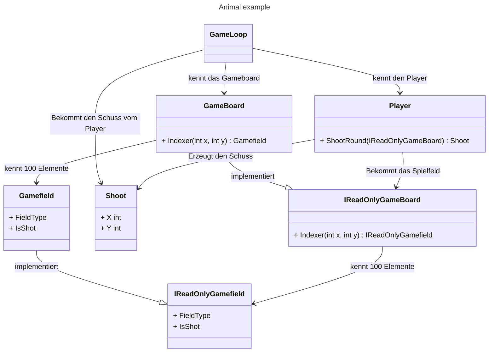

# Klassendesign

```mermaid


---
title: Animal example
---
classDiagram
    
    GameLoop --> Player : kennt den Player
    GameLoop --> GameBoard : kennt das Gameboard
    GameBoard --> Gamefield : kennt 100 Elemente
    GameLoop --> Shoot : Bekommt den Schuss vom Player
    GameBoard --|> IReadOnlyGameBoard : implementiert
    Gamefield --|> IReadOnlyGamefield : implementiert
    IReadOnlyGameBoard --> IReadOnlyGamefield : kennt 100 Elemente
    Player --> Shoot : Erzeugt den Schuss
    Player --> IReadOnlyGameBoard : Bekommt das Spielfeld

    class GameBoard {
      + Indexer(int x, int y) Gamefield
    }
    class Gamefield{
      + FieldType
      + IsShot
    }
    class Shoot {
        + X int
        + Y int
    }
    
    class Player {
      + ShootRound(IReadOnlyGameBoard) Shoot
    }
    
    class IReadOnlyGameBoard {
      + Indexer(int x, int y) IReadOnlyGamefield
    }
    class IReadOnlyGamefield{
      + FieldType
      + IsShot
    }
    class GameLoop 
```
